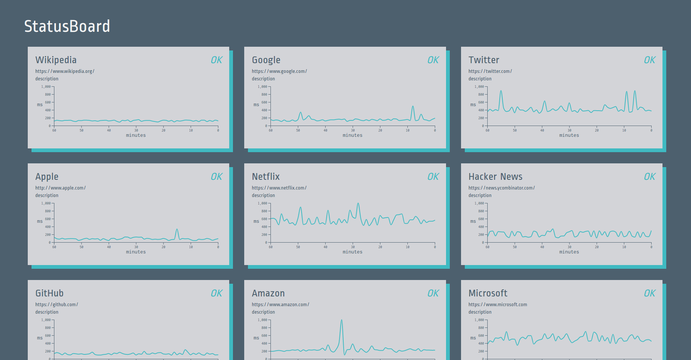

# StatusBoard

Simple HTTP status checker written in Go, complete with a dashboard for all your configured endpoints.

The front-end page will automatically subscribe to update events, which are Server-Sent Events. All concurrently connected clients will receive the same update events. Slack error notifications can also be configured.

<p align="center">
  
</p>

## Installing

**Config**

Modify `static/config.json`. Add as many HTTP/HTTPS endpoints as you need. Each endpoint can be configured with its own status check interval (in seconds), and timeout limit (in milliseconds). The only requirement is that `id` be unique for each endpoint.

**Slack notifications**

Add your Slack webhook URL and message settings to the config for error notifications. To skip Slack notifications, these can be left as empty strings.

**Start server**

```go
go run server.go
```

http://localhost:8080

The page will automatically subscribe to update events. Currently it's configured to display events from the most recent hour.

**Nginx**

If running behind an Nginx proxy, the following is required for the SSEs to work:

```nginx
proxy_set_header Connection '';
proxy_http_version 1.1;
chunked_transfer_encoding off;
```

## Notes

There is just enough functionality to be useful, but the advantage is that it's extremely easy to setup. If more advanced features are required, such as TCP endpoints, advanced SSL requirements, data persistence, etc., there are some other great libraries, such as Sourcegraph's [Checkup](https://github.com/sourcegraph/checkup).

## License

[MIT](https://github.com/transcranial/statusboard/blob/master/LICENSE)
